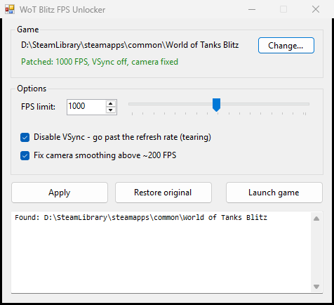

# wotb-fps-unlock

Снимает потолок в 120 FPS в World of Tanks Blitz (Steam, app 444200) — и чинит баг
сглаживания камеры, который вылезает, как только потолок снят.



## Как пользоваться

1. Скачай `WotbFpsUnlock.exe` из [Releases](../../releases) и запусти.
2. Игру закрой — патчер не тронет запущенный клиент.
3. Выстави ползунком желаемый FPS, нажми **Apply**.
4. В игре: **Настройки → Графика → Ограничение частоты кадров** → правый пункт.

> Правый пункт по-прежнему подписан `120`. Это не ошибка: подпись берётся из имени
> enum, а не из строки локализации (подробности ниже). Отдаёт он уже выставленное
> значение.

**Restore original** возвращает всё в исходное состояние в один клик.

Ничего ставить не нужно: программа собрана под .NET Framework, который есть в любой
Windows. Если игра лежит в `Program Files`, приложение само предложит перезапуститься
от администратора.

## Что именно делается

Три независимых патча, каждый включается и откатывается отдельно:

| | |
|---|---|
| **FPS limit** | снимает потолок 120 |
| **Disable VSync** | снимает жёстко включённую вертикальную синхронизацию — без этого потолком остаётся герцовка монитора |
| **Fix camera smoothing** | чинит сглаживание камеры выше ~200 FPS |

Трогается только `wotblitz.exe`, суммарно **13 байт**. Оригинал копируется в
`<папка игры>\BlitzFpsUnlock.backup\`.

## Вариант для консоли

Та же логика доступна скриптом, без графики:

```powershell
.\Unlock-BlitzFPS.ps1 -Status                     # посмотреть текущее состояние
.\Unlock-BlitzFPS.ps1 -TargetFps 1000 -VSync Off  # максимум кадров
.\Unlock-BlitzFPS.ps1 -TargetFps 240              # стабильные 240 под герцовку
.\Unlock-BlitzFPS.ps1 -Restore                    # откатить всё обратно
```

## Сборка из исходников

```powershell
.\build.ps1
```

Собирает `bin\WotbFpsUnlock.exe` и `bin\dvpl.exe` компилятором C#, который входит
в состав Windows. Ни .NET SDK, ни Visual Studio не требуются.

---

## Что происходит под капотом

Меню Blitz предлагает ровно три значения — 30, 60 и 120. Это не настройка, которую
можно поправить в конфиге: значения зашиты в код.

**Что выяснилось при разборе клиента:**

1. Все конфиги в `Data\` упакованы в контейнеры `.dvpl` — это формат движка DAVA:
   полезная нагрузка, сжатая LZ4, плюс 20-байтовый футер
   (`srcSize | compSize | crc32 | type | "DVPL"`). Распаковщик — в [src/Dvpl.cs](src/Dvpl.cs).

2. В `Data\GraphicsPresets.yaml` действительно есть поле `FPSLimit`, но оно принимает
   только `30`/`60`/`120`. Старый рецепт из интернета «поправь yaml и получишь 144»
   на актуальной версии не работает — значение проходит через enum и отбраковывается.

3. `FPSLimit` в клиенте — это `enum DAVA::eFPSLimit` со значениями **0, 1, 2**.
   Строки `"30"`, `"60"`, `"120"` — всего лишь имена, которые видно в реестре enum
   по адресу `.text:0x49EC0D`:

   ```asm
   push offset "30"  ; push 0 ; call Register
   push offset "60"  ; push 1 ; call Register
   push offset "120" ; push 2 ; call Register
   ```

4. Настоящие числа появляются в
   `GraphicsOptionsApplier::SwitchT<int, eFPSLimit>::operator int`. Компилятор
   (клиент 32-битный) свернул switch в три `lea`, прибавляющих константу к самому
   номеру случая:

   ```asm
   test eax, eax        ; case 0
   lea  edi, [eax+0x1E] ;  0 + 30  = 30
   cmp  eax, 1          ; case 1
   lea  edi, [eax+0x3B] ;  1 + 59  = 60
   cmp  eax, 2          ; case 2
   lea  edi, [eax+0x76] ;  2 + 118 = 120   <-- вот он, потолок
   ```

   Смещение в `lea` — знаковый байт, максимум `2 + 127 = 129`. Поэтому поменять одну
   константу мало: нужна инструкция с 32-битным операндом.

5. Патч переписывает третий случай, укладываясь ровно в те же 8 байт:

   ```asm
   ; было:  8D 78 76           lea edi, [eax+0x76]
   ;        E9 <rel32>         jmp  epilogue
   ; стало: BF <imm32>         mov edi, <TargetFps>
   ;        EB EF              jmp  short (на jmp из case 1 — он ведёт туда же)
   ;        90                 nop
   ```

   Размер функции не меняется, ничего не сдвигается, code cave не нужен.
   `jne`, который перепрыгивает этот блок при `eax != 2`, продолжает попадать
   ровно туда же, куда и раньше.

6. **Подпись пункта в меню остаётся «120».** Ключи локализации
   `#settings:Graphics/FPSLimit/30|60|120` в `Data\Strings\*.yaml.dvpl` существуют, но
   на сами кнопки не влияют — проверено: заголовок и описание опции из того же файла
   отрисовываются, а подписи значений нет. Комбобокс печатает **имя enum**, а оно
   лежит в `.rdata` по адресу `0x0364FA54` и занимает ровно 4 байта (`"120\0"`).
   Переименовать можно, но тогда сохранённая настройка (`FPSLimit: "120"` в облаке
   Steam) перестанет совпадать с картой enum и сбросится. Овчинка выделки не стоит —
   подпись косметическая, значение за ней настоящее.

Поиск идёт по сигнатуре всего switch-блока, а не по жёсткому смещению — она
встречается в образе ровно один раз. Если Wargaming перекомпилирует клиент и
сигнатура перестанет совпадать, скрипт честно откажется патчить, а не испортит файл.

---

## Что именно меняется на диске

Только `wotblitz.exe`, три места:

| Смещение | Байт | Зачем |
|---|---|---|
| `0x2AC5A4` | 8 | `lea edi,[eax+0x76]` → `mov edi, N` — потолок FPS |
| `0x9651B6` | 1 | `and ecx,1` → `and ecx,0` — SyncInterval у `Present` |
| `0x12098E3`, `0x120990B` | 2 × 4 | адрес константы квантования — камера |

Итого 13 байт.

Больше ничего. Оригинал складывается в `<папка игры>\BlitzFpsUnlock.backup\` вместе с
`manifest.json` (SHA256 до и после, смещение патча, дата). `-Restore` возвращает всё
побайтово.

---

## Что нужно знать

- **Обновления Steam затирают патч.** После каждого патча игры запускай скрипт
  заново. `-Status` покажет, слетело ли.
- **«Проверка целостности файлов» в Steam** тоже откатит изменения — это штатный
  способ вернуть всё в исходное состояние, если что-то пойдёт не так.
- **Это модификация клиента**, а правила Wargaming запрещают изменённые клиенты.
  Технически это не чит — доступа к игровой информации патч не даёт и на механику
  не влияет, только на частоту кадров. Но формально риск санкций существует,
  и решение тут твоё.
- Ставить значение сильно выше герцовки монитора смысла мало: лишние кадры никуда
  не выводятся, зато греется видеокарта. Для 240 Гц разумный потолок — 240.

---

## Камера (`-CameraFix On`, включён по умолчанию)

Подсказка в меню — *«улучшает поведение камеры при 120 fps»* — не случайна: у клиента
действительно есть баг сглаживания камеры, и он вылезает ровно тогда, когда снимаешь
потолок.

`GameCameraUpdateSystem::Process` для каждой камеры вызывает функцию по `VA 0x160A4B0`.
Та считает коэффициент экспоненциального сглаживания так:

```c
float avgDt = СреднееВремяКадра();             // скользящее среднее по ≤7 кадрам
float f = roundf(avgDt * 100.0f) / 100.0f;     // квантование до 10 мс
f *= coef;                                      // [esi+0x354], ~9.0
f = clamp(f, 0.01f, 1.0f);
```

Средний шаг квантуется до **10 мс**. Выше ~200 FPS кадр короче 5 мс, `roundf` возвращает
**ноль**, и коэффициент падает на нижний кламп `0.01`:

| FPS | avgDt | roundf(dt·100) | коэффициент | постоянная времени |
|---|---|---|---|---|
| 30 | 33 мс | 3 | 0.27 | 0.12 с |
| 60 | 17 мс | 2 | 0.18 | 0.09 с |
| 120 | 8.3 мс | 1 | 0.09 | 0.09 с |
| 240 | 4.2 мс | **0** | 0.01 *(кламп)* | **0.42 с** |
| 1000 | 1.0 мс | **0** | 0.01 *(кламп)* | **0.42 с** |

Отсюда и «кинематографичность»: камера становится вчетверо вязче, а 240 и 1000
ощущаются **одинаково**, потому что оба упираются в один и тот же кламп.

Патч не трогает ни одной инструкции — он лишь **перенаправляет оба операнда** с
константы `100.0f` на `100000.0f`, которая уже лежит в `.rdata` (единственное вхождение,
выровнено по 4):

```asm
  mulss xmm0,ds:[0362E054]   ->   mulss xmm0,ds:[0369507C]
  divss xmm0,ds:[0362E054]   ->   divss xmm0,ds:[0369507C]
```

Меняется 2 × 4 байта. Шаг квантования становится 0.01 мс вместо 10 мс, то есть
`roundf` перестаёт обнулять значение вплоть до 100 000 FPS:

| FPS | avgDt | было `roundf(dt·100)/100` | стало `roundf(dt·100000)/100000` |
|---|---|---|---|
| 120 | 8.33 мс | 0.01 | 0.00833 |
| 240 | 4.17 мс | **0** → кламп 0.01 | 0.00417 |
| 1000 | 1.00 мс | **0** → кламп 0.01 | 0.00100 |

Постоянная времени выходит 0.11 с **на любой частоте кадров**. Побочный бонус:
пропадает и ступенька между 30/60/120.

> **Почему именно так, а не вырезать квантование.** Первая версия патча заменяла весь
> 53-байтовый блок на `movss` + `nop`-заполнение (`push ecx` и `add esp,4` обрамляли
> аргумент `roundf`, поэтому убирались парой — стек оставался сбалансированным).
> Арифметически это было верно, но игра падала при входе в бой с access violation.
> Причину по дизассемблеру найти не удалось, поэтому подход заменён на минимальный:
> управление, вызовы и работа со стеком остаются ровно такими, какими их сгенерировал
> компилятор.

## VSync (`-VSync Off`)

Пункта VSync в меню Blitz нет вообще, а в логе стоит `VSync: true` — синхронизация
включена жёстко, и на 240 Гц это и есть настоящий потолок.

Правится она в `rhi::dx11_PresentBuffer` — там, где собирается аргумент `SyncInterval`
для `IDXGISwapChain::Present`:

```asm
mov  ecx, ds:[4033B30h]   ; слово флагов рендера
mov  edx, ds:[40339ACh]   ; dx11.swapChain
shr  ecx, 1
and  ecx, 1               ; ecx = vsync ? 1 : 0   <-- сюда
test edx, edx
je   <нет swapchain>
mov  eax, [edx]           ; vtable
push 0                    ; Flags
push ecx                  ; SyncInterval
push edx                  ; this
call dword ptr [eax+20h]  ; IDXGISwapChain::Present (индекс 8)
```

`-VSync Off` меняет `and ecx,1` на `and ecx,0` — **один байт**, `01` → `00`. Длина
инструкции та же, управление не меняется, а флаги, которые оставляет `and`, всё равно
перетираются следующим `test edx,edx` до любого перехода. `-VSync On` возвращает `01`.

> Первая попытка патчила `GraphicsOptionsApplier::Apply` (поле `GraphicsOptions::vsync`
> по смещению `0x50`, найдено через `push 0x50; push "VSync"` в `.text:0x493DDD`).
> Не сработало: ангар всё равно держал ровно 240. Опция там уже прочитана движком, а
> swapchain синхронизируется независимо — поэтому давить надо на сам `Present`.

Со снятой синхронизацией появится тиринг: кадры перестают совпадать с обновлением
экрана. Это обратная сторона, и она неизбежна — `-VSync On` возвращает всё назад.

## Что осталось нерешённым

**Подпись пункта в меню.** Остаётся `120` при любом выставленном значении — см. пункт 6
выше. Лечится только переименованием значения enum в `.rdata`, а это ломает сохранённую
настройку в облаке Steam. Не стоит того.

**Отдельный лимит ангара.** В дев-настройках движка (`Data\optionsGlobal.yaml`,
распаковывается `dvpl.exe`) есть флаг `Lobby fps limit enabled: true`, а значение
хранится в `%LOCALAPPDATA%\WoTBlitz\DAVAProject\optionsGlobal.bin` — бинарном
`KeyedArchive` со строковой таблицей. Прямых ссылок на имя в exe нет (обращение
косвенное), так что одной сигнатурой его не снять. На практике это не мешает: с
применёнными патчами ангар идёт на той же частоте, что и бой, — то есть флаг либо
не активен в релизной сборке, либо ограничивает что-то иное.

---

## Состав

| | |
|---|---|
| `src/Program.cs`, `src/MainForm.cs` | приложение с интерфейсом |
| `src/Patcher.cs` | вся логика: поиск игры, сигнатуры, патч, откат |
| `src/Dvpl.cs` | кодек контейнеров `.dvpl` (LZ4 + CRC32 + футер) |
| `src/Sig.cs` | поиск байтовых сигнатур с маской (для PowerShell-варианта) |
| `Unlock-BlitzFPS.ps1` | то же самое из консоли |
| `build.ps1` | сборка обоих бинарников |

`dvpl.exe` полезен сам по себе, если захочешь ковырять другие конфиги:

```
dvpl unpack <file.dvpl> [out]     распаковать
dvpl pack   <file> [out.dvpl]     запаковать
dvpl info   <file.dvpl>           показать футер
dvpl grep   <dir> <text>          искать текст во всех .dvpl рекурсивно
```

Компилятор берётся из состава Windows (`C:\Windows\Microsoft.NET\Framework64\v4.0.30319\csc.exe`),
ставить ничего не нужно.
